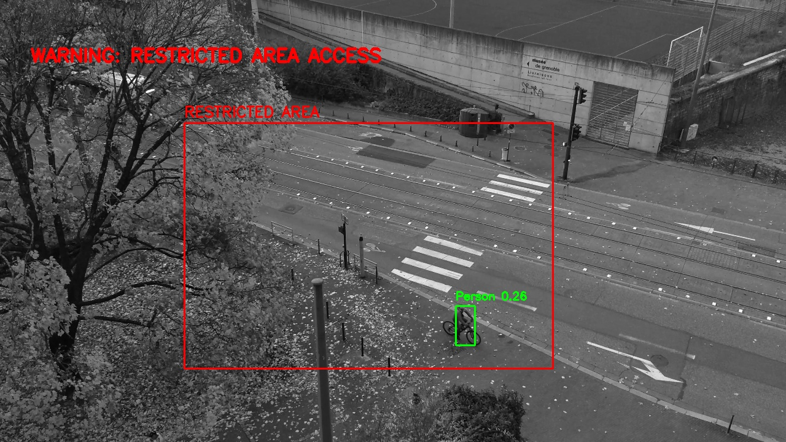

# AI-CCTV-Surveillance-System
AI-CCTV-YOLO

AI-powered CCTV surveillance system using YOLOv8 and OpenCV for real-time object detection, restricted area monitoring, and automated evidence capture.

- Overview

AI CCTV Surveillance System is a Computer Vision and Artificial Intelligence project developed to simulate an intelligent CCTV monitoring solution using YOLOv8.

The system is capable of detecting multiple objects in real time from CCTV video streams, including people, bicycles, vehicles, and trains/trams. Detected objects are automatically highlighted using bounding boxes and confidence scores.

In addition, the system includes a restricted area monitoring feature that triggers warning alerts and automatically captures screenshot evidence whenever a person enters a predefined restricted zone.

This project demonstrates the practical implementation of:

- Artificial Intelligence
- Computer Vision
- Deep Learning
- Real-Time Object Detection
- CCTV Surveillance Automation
- Security Monitoring Systems

The project was developed using Python, OpenCV, and Ultralytics YOLOv8.

Features:

-Real-time CCTV monitoring

-YOLOv8 object detection

-Restricted area warning system

-Automatic screenshot evidence capture

-Train / tram detection

-Vehicle detection

-Person & bicycle detection

-Confidence score visualization

-CCTV dashboard overlay

-Video output generation

Technologies Used

- Python
- OpenCV
- YOLOv8
- Ultralytics
- NumPy

- Video Source

The CCTV sample video used in this project was obtained from Pexels:

https://www.pexels.com/video/black-and-white-aerial-view-of-lyon-traffic-34364652

Thanks to the original creator for providing free-to-use footage for educational and portfolio purposes.

- Detection Capabilities

The system can detect:

- Person
- Bicycle
- Car
- Truck
- Bus
- Motorcycle
- Train / Tram

- Restricted Area Monitoring

The system automatically detects human activity inside a restricted area and generates warning alerts in real time.

When suspicious access is detected, the system:
- Displays warning notifications
- Captures screenshot evidence
- Saves monitoring results automatically

### Automated CCTV Detection Result

